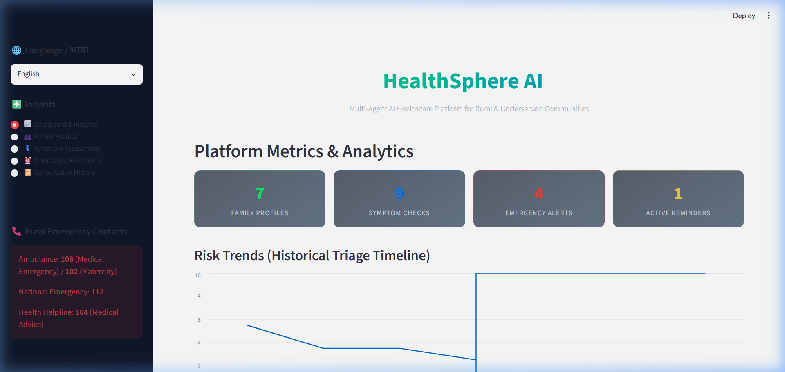
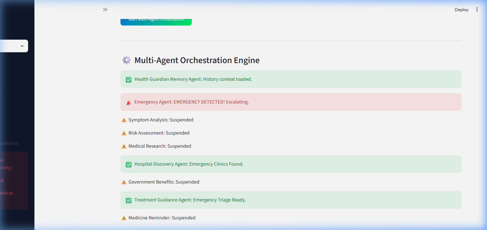
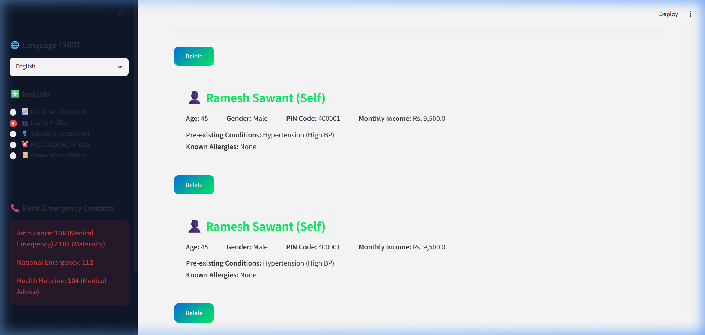
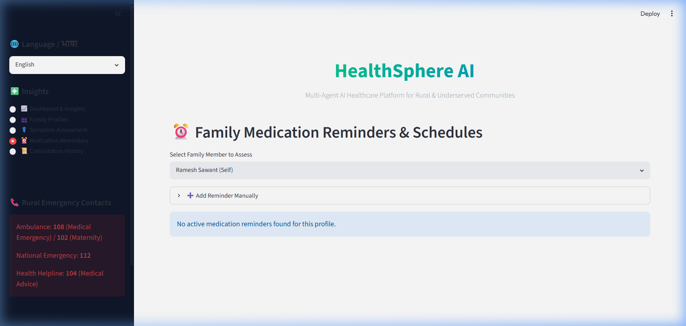
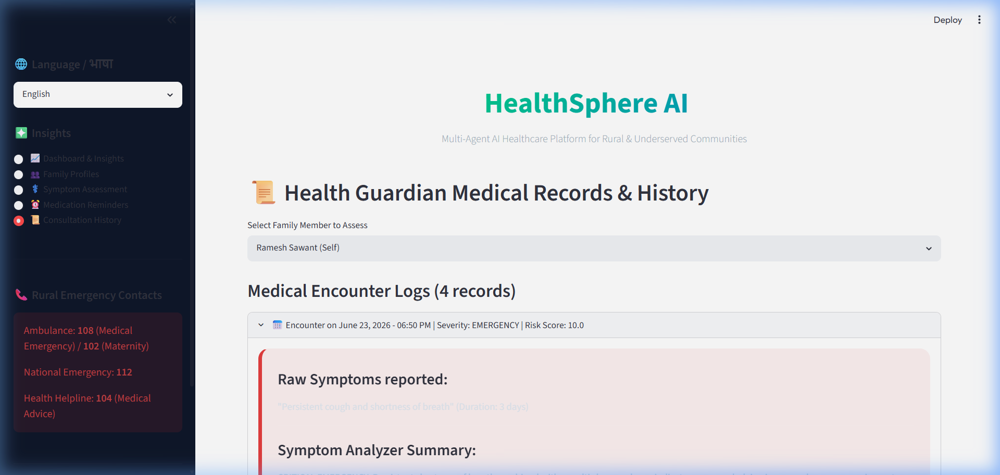

# HealthSphere AI ❇️

HealthSphere AI is a state-of-the-art **Multi-Agent Rural Healthcare Portal** designed to bridge the gap between rural/underserved communities and quality clinical assistance. By leveraging specialized AI agents cooperating through an intelligent orchestration layer, HealthSphere AI provides bilingual symptom assessment, risk triage, local healthcare discovery, government health scheme eligibility check, and medication reminder scheduling.

---

## 📸 System Previews

Here is a visual tour of the HealthSphere AI portal:

### 1. Main Dashboard & Insights
View clinic-wide metrics, emergency alerts, active schedules, and historical risk level trends plotted dynamically.


### 2. Multi-Agent AI Symptom Triage
Perform intelligent symptom analysis with a structured assessment, risk score, clinical research citations, home care recommendations, eligible welfare benefits, and recommended local healthcare clinics.


### 3. Family Health Profiles
Manage individual profiles for each family member, including age, gender, monthly income, location PIN code, pre-existing conditions, and drug/environmental allergies.


### 4. Medication Reminders & Schedules
Add medication schedules manually or directly import AI-suggested drug dosages, frequencies, and timings.


### 5. Historical Consultation Logs
Access past clinical sessions indexed in the patient's long-term memory.


---

## 🛠️ Technology Stack

* **Frontend**: Streamlit (Bilingual UI in Hindi and English, styled with custom glassmorphic CSS)
* **Backend API**: FastAPI (Asynchronous endpoints, structured request/response schemas)
* **LLM Engine**: Google Gemini API via `google-genai` SDK
* **Database**: SQLite (SQLAlchemy ORM for Profiles, Encounters, and Medication Reminders)
* **Vector Memory**: ChromaDB (Semantic indexing of past patient history to simulate longitudinal memory)
* **Validation**: Pydantic v2 (Data validation and structured generation output parsing)

---

## 🧠 Multi-Agent Architecture

HealthSphere AI uses a collaborative **Multi-Agent Orchestration Model** where multiple LLM-powered agents collaborate to form a comprehensive diagnostic and welfare recommendation.

### Agent Registry

1. **Health Guardian Memory Agent**: Retrieves similar past patient encounters from the semantic ChromaDB vector store and synthesizes a patient-specific historical context.
2. **Emergency Agent**: Inspects symptoms for life-threatening markers (chest pain, respiratory failure, stroke signs). If found, it immediately short-circuits the flow for an immediate emergency bypass.
3. **Symptom Analysis Agent**: Translates, parses, and summarizes complex natural language symptom descriptions into clear clinical parameters.
4. **Risk Assessment Agent**: Evaluates the parsed symptoms along with history to determine a quantitative risk score (0.0 to 10.0) and severity level (LOW, MEDIUM, HIGH, EMERGENCY).
5. **Medical Research Agent**: Pulls evidence-based clinical guidance and studies related to the assessed conditions to provide citations and clinical contexts.
6. **Hospital Discovery Agent**: Queries the database for local clinics, primary health centers (PHCs), or community health centers (CHCs) using the patient's ZIP code, ranking and routing them based on specialties and distance.
7. **Government Benefits Agent**: Evaluates the family's profile (age, monthly income, gender, location) against registered state/national schemes (such as *Ayushman Bharat PM-JAY*, *Janani Suraksha Yojana*, etc.) and provides application walkthroughs.
8. **Treatment Guidance Agent**: Formulates home care instructions, warning signs (Red Flags), and clinical disclaimers.
9. **Medicine Reminder Agent**: Extracts specific prescription instructions, frequencies, and times from the treatment guidance to propose automated Streamlit notifications.

### Workflow Sequence

```mermaid
flowerchart
graph TD
    User([User Symptoms Input]) --> HG[Health Guardian Agent]
    HG -->|Query Vector History| DB[(ChromaDB Vector Store)]
    HG -->|Generate History Context| EM[Emergency Agent]
    
    EM -->|Check Emergency Markers| EM_Check{Is Emergency?}
    
    %% Emergency Path (Short-circuit)
    EM_Check -->|Yes| HD_Emerg[Hospital Discovery Agent]
    HD_Emerg --> TG_Emerg[Treatment Guidance Agent]
    TG_Emerg --> Enc_Save_Emerg[(Save SQLite & ChromaDB)]
    Enc_Save_Emerg --> Output_Emerg[Return Emergency Triage]
    
    %% Standard Path
    EM_Check -->|No| SA[Symptom Analysis Agent]
    SA --> RA[Risk Assessment Agent]
    RA --> MR[Medical Research Agent]
    MR --> HD[Hospital Discovery Agent]
    HD --> GB[Government Benefits Agent]
    GB --> TG[Treatment Guidance Agent]
    TG --> MRm[Medicine Reminder Agent]
    MRm --> Enc_Save[(Save SQLite & ChromaDB)]
    Enc_Save --> Output[Return Full Diagnostic Triage]
```

---

## 🚀 Getting Started

### 1. Prerequisites
* Python 3.10 or higher
* Git CLI
* GitHub CLI (`gh` - for repo/remote management)
* Gemini API Key

### 2. Installation & Setup
Clone the repository:
```bash
git clone <your-repository-url>
cd healthsphere-ai
```

Create a virtual environment and activate it:
```bash
python -m venv venv
# On Windows (Command Prompt)
venv\Scripts\activate
# On Windows (PowerShell)
.\venv\Scripts\Activate.ps1
# On macOS/Linux
source venv/bin/activate
```

Install backend and frontend dependencies:
```bash
pip install -r backend/requirements.txt
pip install streamlit requests pandas
```

### 3. Environment Variables
Create a `.env` file in the root directory:
```env
GEMINI_API_KEY=your_gemini_api_key_here
```

### 4. Running the Application
Launch both the FastAPI backend and Streamlit frontend together using the Startup Manager:
```bash
python run.py
```

* **FastAPI Backend URL**: `http://127.0.0.1:8000`
* **Streamlit Frontend URL**: `http://127.0.0.1:8501`

*(Note: The database is automatically initialized and seeded with mock clinics and schemes on the first start.)*

---

## 🛡️ License

This project is licensed under the MIT License. See the [LICENSE](LICENSE) file for details.
